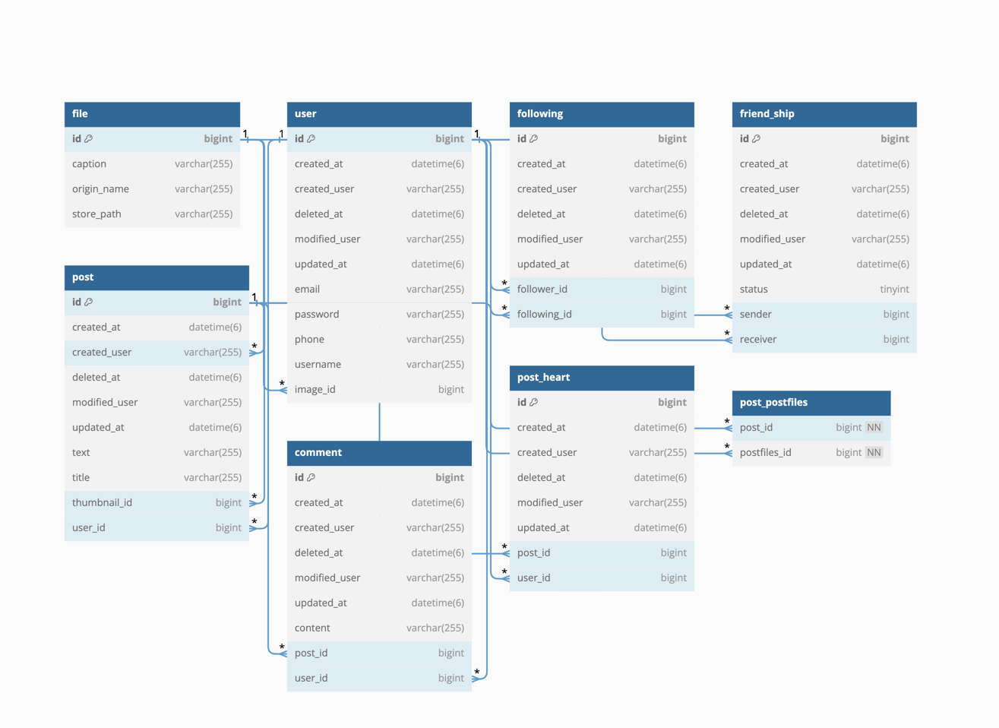
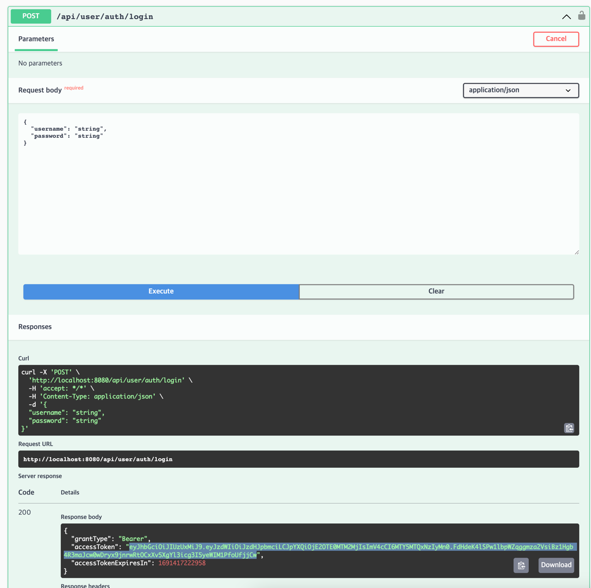
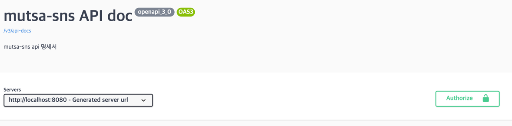
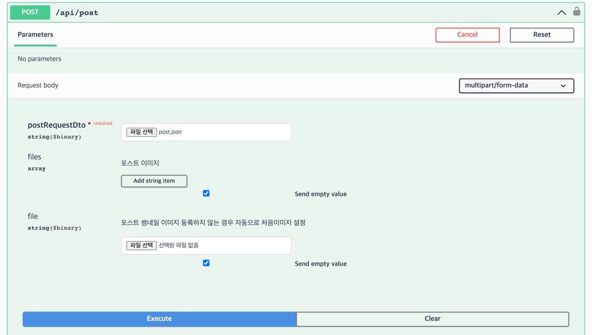

# Project_2_ParkJuhee

## 🌟프로젝트 개요

## 🔨개발 환경
개발환경 :  
통합 개발 환경 :   
개발 언어 :   
개발 프레임 워크:  
데이터베이스 :  
도구 : 

  

## 📄 요구사항 명세

## 👩🏻‍💻 개발

### 🗃ER 다이어그램

### 🐬 실행
1. 깃 클론을 진행합니다.`git clone https://github.com/likelion-backend-5th/Project_2_ParkJuhee.git`
2. 그래들을 빌드합니다. 터미널,cli환경에서 `gradlew build` 을 입력하는 방법도 있습니다. 
3. 이후 cli에서 `java -jar build/libs/market-0.0.1-SNAPSHOT.jar`를 실행시킨후
swagger링크 : [http://localhost:8080/swagger-ui/index.html#/](http://localhost:8080/swagger-ui/index.html#/) 에 접속합니다. (문서화된 스웨거 링크 )
4. postman을 이용한 테스트 {포스트맨 실행 추가}

### 📗 Swagger 사용방법
1. 메인 화면 

2. 로그인 후 토큰 발급 (마우스로 드래그한 부분을 복사합니다.)

3. Authorize 버튼을 클릭하고 이전에 복사한 값을 넣어줍니다.

4. 이후에 권한이 필요한 API를 테스트 할 수 있습니다.

5. **swagger 확인사항**
post등록, 수정 부분에서 멀티 파트이미지와 json을 동시에 폼 데이터로 전송하여 해당 부분에서는 json파일을 넣어줘야합니다. 
해당 부분에서는 readme폴더 내에 있는 post.json파일을 넣어서 테스트할 수 있습니다.

## 🌌 프로젝트 실행 기간
1인 프로젝트   
1차: 2023/08/06 ~ 2023/08/08  

